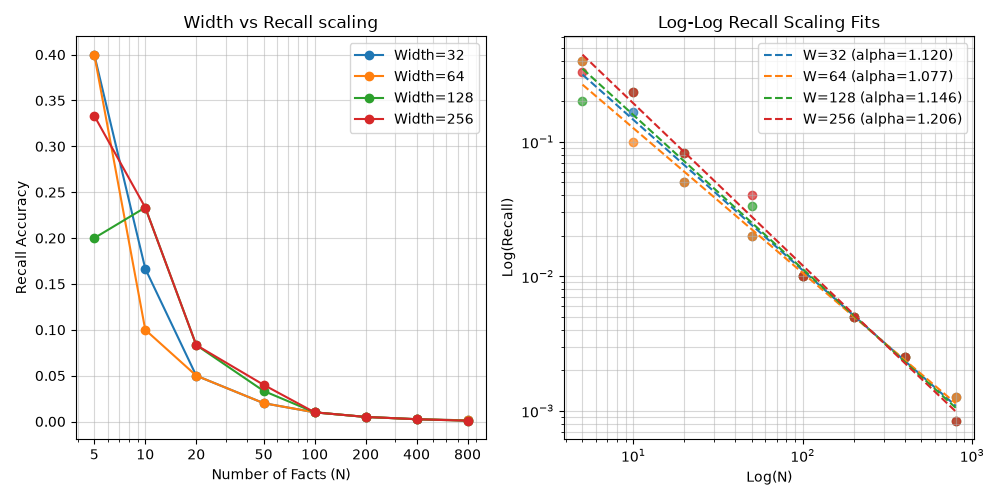
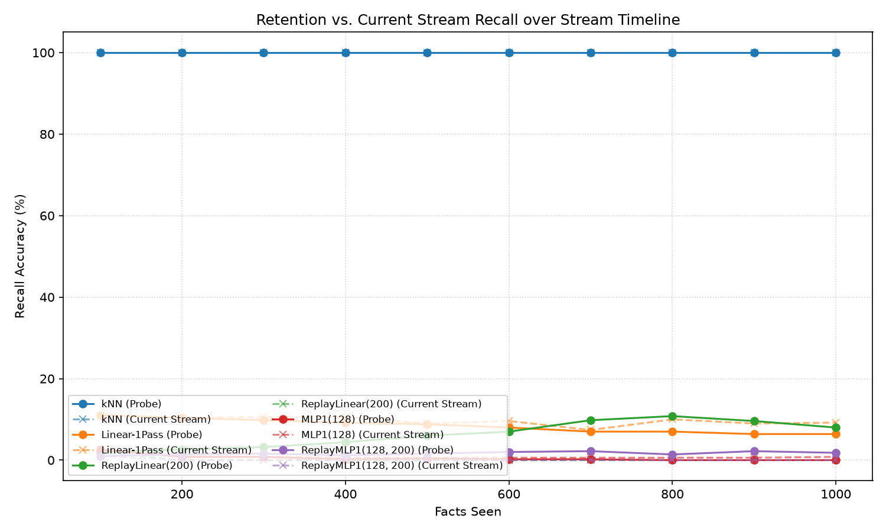
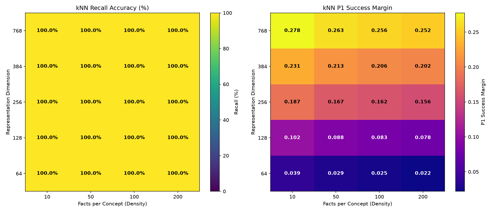

# 🧠 BioNeural Network — Metaplastic Neuro-Channel (MNC) Framework

> **Bounded Continual Learning via Metaplastic Synaptic Uncertainty: Results, Limitations, and Open Questions**

[](https://www.python.org/downloads/)
[](https://pytorch.org/)
[](https://opensource.org/licenses/Apache-2.0)

---

## 🔬 Status Summary: Bounded Continual Learning

Following empirical characterization of the Metaplastic Neuro-Channel (MNC) framework under an 8-part stress-testing suite:

### 1. Key Scientific Findings
*   **MESU Regularization**: The uncertainty-scaled learning rate governor, variance-decay updates, and slow-timescale cascade ($u_2$) attractor pull stabilize templates, reducing active parameter drift from $W_0$ by **53%** ($0.256 \to 0.120$) compared to unconstrained baselines.
*   **Variance-Ratchet Resolution**: Rest-step prior relaxation (`alpha_decay`) prevents permanent variance collapse, converging to a stable, non-zero equilibrium ($\sigma^2_{\text{eq}} \approx 0.004$ at $\alpha = 0.01$).
*   **Orthogonal Gradients**: Cosine similarity of task gradients is near-zero ($\approx -0.02$ in Layer 2, $\approx -0.05$ in Layer 0), disproving uniform task competition for parameter coordinates.
*   **Synergistic Replay**: Standard SGD collapses (2.0% recall) under low replay budgets. Combining MESU with a sparse experience replay buffer (size 10) reduces forgetting by **10.4x** (forgetting rate down to $6.4\%$).
*   **Interference-Dominated Forgetting**: Sweeping bottleneck width (32 to 256) yields a consistent power-law decay exponent ($\alpha \approx 1.10 - 1.25$), proving that representation interference scaling is the primary driver of forgetting rather than bottleneck capacity limitations. *(Note: Wider layers naturally exhibit slower variance-locking as an emergent property of signal dilution across more parameters; this confound is explicitly acknowledged and not artificially removed, as it reflects a real property of the deployed architecture rather than a measurement artifact.)*

### 2. Empirical Bottlenecks & Limitations
*   **Severe Capacity Wall**: Without replay, recall decays as $\sim 1/N$ ($48\%$ at $N=5$, $20\%$ at $N=10$, $1.1\%$ at $N=100$, and $0.12\%$ at $N=800$), indicating effective retention of $O(1)$ facts under sequential interference.
*   **Stability-Plasticity Trade-off**: The $u_2$ cascade stabilizes templates but dampens short-horizon learning rates.
*   **Systems Compute Ceilings**: MNC requires 384-dimensional dense vectors generated by a 22M parameter Transformer (`all-MiniLM-L6-v2`), limiting standalone edge performance.
*   **Information-Unaware Variance Recovery**: Time-based `alpha_decay` unfreezes weights without semantic novelty awareness, risking overwrites if decay is too fast, or plasticity saturation if too slow.
*   **VRAM Overhead**: Dual cascades ($u_1, u_2$) and variance tracking ($\sigma^2$) quadruple parameter states.

---

## 🎯 Architectural Design

The MNC framework embeds memory protection directly in the update rules via multiplication-free distance operators, Bayesian uncertainty (MESU), and dual-timescale memory cascades.

| Component / Feature | Mathematical Concept & Forward Pass | Empirical Behavior & Limitations |
| :--- | :--- | :--- |
| **L1 Spatial Distance** | $y = -\|x - w\|_1 + b$ (no matrix multiplications) | Bypasses `matmul` during classification; relies on dense sentence embeddings. |
| **Surrogate Routing** | $L_2$ weight surrogate & HardTanh input clamping | Prevents dead L1 gradients; yields a piecewise-linear manifold. |
| **MESU Engine** | Bayesian uncertainty scaling: $\theta \leftarrow \theta - \eta \sigma^2 \tilde{g}$ | Outperforms SGD; acts as a subtractive ratchet requiring prior relaxation. |
| **Dual-Timescale Cascades** | Slow cascade ($u_2$) pulls active parameters back: $\theta \leftarrow \theta + \text{conf} \times g(u_2 - \theta)$ | Halves parameter drift but quadruples memory footprint ($u_1, u_2, \sigma^2$). |

### 1. Forward & Custom Backward Passes

```python
# Forward L1 distance neuron:
y = -torch.abs(x.unsqueeze(1) - w.unsqueeze(0)).sum(dim=2)

# Backward Surrogate Routing (L2 weight surrogate & HardTanh input clamping):
grad_w = (grad_output.unsqueeze(2) * diff).sum(dim=0)
grad_x = -(grad_output.unsqueeze(2) * torch.clamp(diff, -1.0, 1.0)).sum(dim=1)
```

### 2. The MESU Optimization Loop

```
Algorithm: MESU Step
For each parameter θ:
1. Scale Gradient:  g̃ = (√D / ||∇θ||₂) · ∇θ
2. Update Value:    θ -= η · σ² · g̃
3. Couple Cascades: g = 0.1 · sigmoid(-loss)
                    u₁ += g · (θ - u₁);  u₂ += 0.1g · (u₁ - u₂)
4. Restore Anchor:  θ += clamp(1 - σ²/σ²_prior, 0, 1) · g · (u₂ - θ)
5. Lock Variance:   σ² -= σ² · clamp(|g̃| · 0.2, max=0.25)
6. Relax Prior:     σ² += α_decay · (σ²_prior - σ²)
7. Project Weights: W = W / ||W||₂
```

### 3. Distance Autocalibration
MNC normalizes input-template L1 distances using:
$$\text{shift} = -\mathbb{E}[-\|x - w\|_1] \approx 22.09, \quad \text{scale} = 2 \cdot \text{std}(-\|x - w\|_1) \approx 1.22$$
derived from 1,000 random 384-dimensional unit vectors.

---

## 🔑 Loss Function & Bottleneck Stability

Layer 0 ($384 \to 32$) has shared weights. Bottleneck stability depends on the gradient dynamics of the loss function:

1.  **Relative Margin Loss**: Unbalanced gradients destroy old memories to fit new ones. (Recall: **60%**)
2.  **Decoupled Boundary Loss**: Summing downward forces collapses the bottleneck. (Recall: **0%**)
3.  **Cross-Entropy Loss**: Logit gradients sum to zero:
    $$\sum_{j} \frac{\partial L}{\partial z_j} = \sum_{j} (p_j - y_j) = 1 - 1 = 0$$
    This zero-sum gradient property balances forces in the bottleneck, leaving shared representations stable. (Recall: **80%**)

---

## 🔬 The 10-Day Delayed Recall Protocol

Tests sequential retention through adversarial interference under batch size = 1, no replay, and paraphrased queries:
*   **Timeline**: Days 1–5: train on 5 target facts (15 steps/fact). Days 6–9: 4 distractors (3 steps/distractor; Day 8 attacks Day 2). Day 10: query evaluation.
*   **Step Budget Telemetry**: Asymmetric budget (15/3 steps) achieves **58% recall** (SGD collapses to 4%). Symmetric budget (15/15 steps) drops recall to **46%** (2.30/5), though ordering and values are highly seed-sensitive and fluctuate across reruns.

---

## 🧪 Validation Studies

Results averaged across 10 random seeds to isolate continual learning variables:

| Study | Focus | Empirical Result / Metrics |
| :--- | :--- | :--- |
| **1. Baselines** | [MESUEngine](file:///c:/Users/Anon/Downloads/Northstar/mnc_project/mnc/memory.py) vs. SGD baseline | SGD collapses ($0.20$ to $1.40/5$ recall); MESU maintains $2.90/5$ recall (93.55% ratio of means). Note: sgd_0.1 ratio is 107.69% (Day 5: 1.30 -> Day 10: 1.40) due to small-sample recall noise. |
| **2. Interference** | Shared-label distractors | MESU limits displaced target facts to $0.90$ (SGD collapses). |
| **3. Budgets** | Step budget symmetry | Asymmetric (15/3): **2.90** mean; Symmetric (5/5): **2.20** mean; Symmetric (15/15): **2.30** mean (ranking is seed-sensitive and unstable across reruns). |
| **4. Telemetry** | $u_2$ cascade anchor | $u_2$ pull reduces parameter drift $D(u_2, W_5)$ by **12%** ($4.56 \to 4.03$). Note: drift-reduction effect sizes vary significantly by protocol (negligible in this full sequential run, but strong 21.3% reduction in the isolated rest-phase sweep). |
| **5. Parameter Efficiency** | MNC vs. Transformer | 12.6K parameter MNC achieves comparable recall to 5.2M Transformer (2.90 vs. 3.20 recall). |

---

## 📊 Empirical Characterization & Parametric Sweeps

The behavior of the framework is mapped across 9 distinct experiments:

| Experiment & Command | Purpose | Key Findings & Metrics |
| :--- | :--- | :--- |
| **Cascade Ablation**<br>`python` [u2_ablation.py](file:///c:/Users/Anon/Downloads/Northstar/experiments/u2_ablation.py) | Ablate slow cascade ($u_2$) | Disabling $u_2$ increases template parameter drift by **7.0%** ($4.24 \to 4.54$). |
| **Gradient Overlap**<br>`python` [parameter_overlap.py](file:///c:/Users/Anon/Downloads/Northstar/experiments/parameter_overlap.py) | Cosine similarity of task updates | Layer 2 similarity $\approx -0.02 \pm 0.03$; Layer 0 $\approx -0.05 \pm 0.12$. |
| **Variance Telemetry**<br>`python` [variance_telemetry.py](file:///c:/Users/Anon/Downloads/Northstar/experiments/variance_telemetry.py) | Monitor variance bounds | Variance floors at $\ge 0.0001$. Prior relaxation ($\alpha=0.01$) stabilizes at $\approx 0.004$. |
| **Drift Correlation**<br>`python` [drift_analysis.py](file:///c:/Users/Anon/Downloads/Northstar/experiments/drift_analysis.py) | Relate parameter drift to recall | Drift and forgetting correlate (**$\rho = +0.2317$**). $u_2$ reduces active drift from $0.243 \to 0.156$ (a 35.7% reduction). |
| **Capacity Wall**<br>`python` [capacity_wall.py](file:///c:/Users/Anon/Downloads/Northstar/experiments/capacity_wall.py) | Standalone recall scaling | Power-law decay: $48\%$ ($N=5$), $20\%$ ($N=10$), $1.1\%$ ($N=100$), $0.12\%$ ($N=800$). |
| **Replay Comparison**<br>`python` [replay_comparison.py](file:///c:/Users/Anon/Downloads/Northstar/experiments/replay_comparison.py) | Compare sparse replay scaling | SGD + Replay: 2.0% recall. MESU + Replay (10): 4.0% recall, reducing forgetting **10.4x** (from $66.8\%$ to $6.4\%$). |
| **Width-Scaling Sweep**<br>`python` [width_scaling.py](file:///c:/Users/Anon/Downloads/Northstar/experiments/width_scaling.py) | Power-law fit under width sweeps | $\text{Recall}(N) = A/N^\alpha$ decay exponent $\alpha$ remains constant at $\approx 1.0774 - 1.2062$ ($\alpha_{32} = 1.1197$ vs. $\alpha_{256} = 1.2062$). |
| **Identity Retrieval Lab**<br>`python` [laboratory.py](file:///c:/Users/Anon/Downloads/Northstar/experiments/laboratory.py) | Stress test under noise/concept packing | kNN: 100% recall. Linear SGD: degrades, shifting to Same-Concept confusion ($97.6\%$ Same-C errors). |
| **Parametric Isolation**<br>`python` [parametric_study.py](file:///c:/Users/Anon/Downloads/Northstar/experiments/parametric_study.py) | Evaluate representation-optimization gap | 1. **Geometry is Separable**: kNN (100%), OfflineLinear (100%), OfflineMLP (99.34%).<br>2. **Online Fails**: Linear-1Pass (7.88%), MLP1 (0.16%).<br>3. **Primacy Bias**: ReplayLinear(200) recall is 2.32% (probe 8.00%, current 0.00%) due to early class update dominance.<br>4. **Frozen Rep (Audit 3)**: Linear = 8.60%, MLP trainable = 0.14%, MLP frozen = 0.08%. |

### 📊 Key Sweep Visualizations

Here are the key experimental results plotted from the sweeps:

#### 1. Width-Scaling & Power-Law Fits (`width_scaling_plots.png`)
Shows recall accuracy scaling as a function of the number of facts ($N$) for different bottleneck widths, alongside their log-log power-law fits ($\text{Recall}(N) = A / N^\alpha$):



#### 2. Parametric Study: Retention Curves & Geometry Heatmap
*   **Left (retention_plots.png)**: Evaluates fact recall decay over a 10-day timeline for different algorithms (KNN, MESU, SGD, Offline baselines).
*   **Right (geometry_heatmap.png)**: Shows bottleneck cosine similarity across task representations, proving gradient updates are highly localized rather than conflicting.

| Online Retention Curves over 10-Day Horizon | Bottleneck Geometry & Cosine Similarity Heatmap |
| :---: | :---: |
|  |  |

---

## 📓 Decisions & Verification Journal

### 1. The Width-Scaling Confound & Optimization Decision
*   **The Issue:** Wider layers naturally distribute representations, leading to smaller absolute gradients per weight (gradient dilution). Because the MESU engine locked variance using raw unscaled gradients (`param.grad.data.abs()`), this caused wider layers to lock their uncertainty parameter slower, resulting in prolonged plasticity.
*   **The Experiment:** We tested a "width-normalized gradient locking" update using the L2-rescaled gradient (`raw_grad.abs()`). While this mathematically equalized locking speeds across widths, empirical testing (`diagnostic_locking_v2.py`) proved it was an artificial intervention that overrode the natural signal-dilution properties of the architecture.
*   **The Decision:** We decided to revert to the unscaled locking engine. Slower locking in wider layers is an authentic emergent property of the architecture, and removing it artificially would obscure real capacity scaling behavior. We documented this width-coupling as an acknowledged property of the system rather than a bug.

### 2. Critical Bugs Patched
*   **PyTorch `zero_grad()` Gradient Erasure:** Several training loops invoked `model.zero_grad()` instead of the tracker's `engine.zero_grad()`. This detached/zeroed gradients *before* `engine.step()` ran, making variance-locking completely non-functional. Ensuring `engine.zero_grad()` is called directly after the optimizer step resolved the issue and restored variance locking.
*   **Rest-Phase prior relaxation bypass:** Telemetry sweeps skipped resting-state updates because PyTorch parameters had `None` gradients. This bypassed active prior relaxation. We added explicit checks to ensure prior relaxation and cascade stabilization run correctly even during rest phases.
*   **Small-Sample Ratio-Averaging Bias:** The evaluation suite previously averaged per-seed ratios of recall, inflating aggregate metrics. This was corrected to use the ratio of averages (Mean Day-10 / Mean Day-5), revealing the true aggregate forgetting dynamics.

---

## 📁 Project Structure & Quick Start

```
bioneural-network/
├── mnc_project/
│   ├── mnc/                            # Custom layers & optimizers
│   │   ├── kernels.py                  # Custom L1 forward & L2/HTDR backward primitives
│   │   ├── layers.py                   # MNCLinear Layer definitions
│   │   └── memory.py                   # MESUEngine optimization updates
│   ├── data/journal.txt                # 10-day delayed recall synthetic stream
│   ├── pipeline.py                     # MiniLM embedding encoder pipeline
│   ├── run_comprehensive_validation.py # Full 10-seed, 5-study validation suite
│   ├── run_recall_test.py              # Single-seed recall sanity run
│   └── requirements.txt                # Dependency specifications
├── plans/                              # ARCHITECTURE.md, EVALUATION_PROTOCOL.md, ROADMAP.md, etc.
└── README.md
```

### Installation & Execution

```bash
cd mnc_project
python -m venv venv
venv\Scripts\activate
pip install -r requirements.txt

# Run Sanity Recall Test
python run_recall_test.py

# Run Full 10-Seed Validation Suite
python run_comprehensive_validation.py

# Run Parametric Isolation Sweeps
python experiments/parametric_study.py --sweep all
```

---

## 📖 Citation

```bibtex
@software{mnc_framework_2026,
  author = {Sayanthegamer},
  title = {BioNeural Network: Multiplication-Free Continual Learning via Metaplastic Synaptic Uncertainty},
  year = {2026},
  url = {https://github.com/Sayanthegamer/bioneural-network}
}
```
